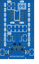

# CH32V003 NanoC (Neo)

CH32V003 NanoC and CH32V003 NanoC Neo are small development borads for the CH32V003 SOP-8 and featuring USB-C power and data.

USB is realized in software using [RV003USB](https://github.com/cnlohr/rv003usb).

The board comes with an USB bootloader compatible with [minichlink](https://github.com/cnlohr/ch32v003fun/tree/master/minichlink). To enter the Bootloader, hold down the Button while plugging in USB.

## Hardware
- CH32V003J4M6 (SOP-8)
- Power LED (3.3V rail)
- Button (switching to GND) on `D1` (used to enter Bootloader on Power-Up)
- LED or SK6812 RGB LED ("Neo" version) on `A2`
- USB-C for power and programming
- Solder jumper to select the USB D- Pull-Up source between 3V and `C4`

## Board Pinout

- `A1`/`D6`
- `A2` (LED or SK6812 RGB LED data in)
- `D1`/`D4`/`D5`/`SWIO` (Button switching to GND)
- `C4` (may be tied to USB D- via 1.5K)
- `C2` (USB D-)
- `C1` (USB D+)
- `3V`
- `GND`
- `5V` (directly connected to USB VBUS)

